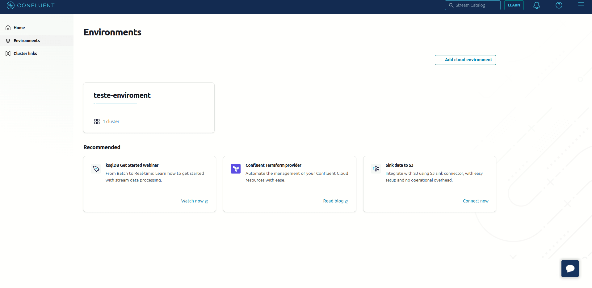
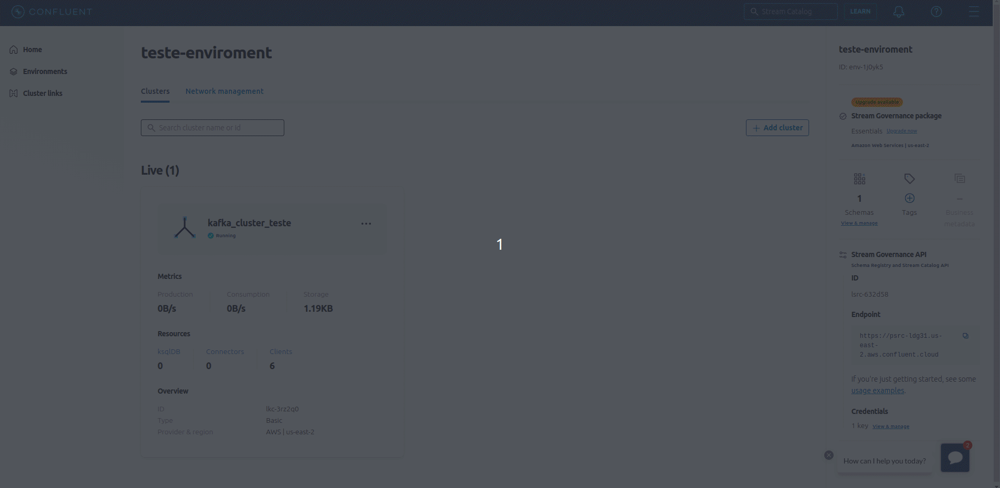

# Terraform - Confluent Cloud
Esse Repositório e destinado ao estudo de criação de recursos na Confluent Cloud utilizando Terraform. Os recursos que serão criados serão:
- Enviroment Confluent Cloud
- Cluster Kafka
- Schema Registry
- Api Key - Schema Registry (Credencial para manutenção de Schemas)
- Api Key - Cluster Kafka (Credencial para criação de recursos no Cluster Kafka)
- Tópico Kafka
- Schema AVRO para um tópico Kafka
- Service Account (Account Confluent Cloud)
- Associação de role ao Service Account com RBAC

******

## Sumário

1. [O que é a Confluent Cloud?](#o-que-é-a-confluent-cloud)
2. [Requisitos](#requisitos)
3. [Configuração Confluent Cloud](#configuração-confluent-cloud)
4. [Criação de ambiente no Terraform](#criação-de-ambiente-no-terraform)
5. [Referências](#referências)


******


## O que é a Confluent Cloud 

A Confluent Cloud é uma plataforma SaaS que oferece serviços totalmente gerenciados, como Apache Kafka, Kafka Stream, KsqlDB.
Atualmente a Confluent Cloud oferece seus serviços nos principais Cloud Providers do mercado, sendo a principal ferramenta de mensageria do Kafka do mercado.

Caso se interesse, foi desenvolvido em outro repositório o desenvolvimento de um Producer e Consumer Kafka utilizando Java e integrado com a Confluent neste [repositório](https://github.com/lucas-silvs/java--kafka-producer-consumer-exemplo).

## Requisitos

- Terraform 1.4.5
- Conta na Confluent Cloud


## Configuração Confluent Cloud


Para execução da criação de recursos com Terraform, será necessário realizar o cadastro de uma conta na plataforma, e não se preocupa em relação a custo, pois para os novos usuários é ofertado teste gratuito de 1 mês para avaliação da plataforma e suas ferramentas.

Com a conta criada, será necessário criar um Cloud API Key e associar as permissões para criação de recursos, que será detalhado nos passos abaixo.


### Criar Service Account Confluent Cloud
Portanto, primeiramente será necessário criar o Service Account e associar as permmissões para criação de recursos. Para isso siga os passos abaixo:


1. Na tela principal, selecione a pilha no lado superior direto e selecione a opção "Account & Acess".

2. Selecione a opção "Service accounts".

3. Selecione a opção "Add service account".

4. Selecione um nome e uma descrição ao Service Account.

5. Adiciona a Role "OrganizationAdmin".

6. Conclua a criação do Service Account.

Abaixo está um exemplo de criação de um Service Account seguindo os passos acima:




### Criar Cloud API Key para uso no Terraform

Com o Service Account criado, deve criar o API Key para ser utilizado no Terraform e associar a API Key ao Service Account.

1. Na tela principal, selecione a pilha no lado superiro direto e selecione a opção "Cloud API Key".

2. Selecione a opção "+ Add Key".

3. Selecione a opção de acesso Granular.

4. Selecione o Service Account criado anteriormente para associar as permissões de "OrganizationAdmin" a credencial.

5. Realize o download das credenciais Cloud API Key.

Abaixo está um exemplo de criação de uma Cloud API Key seguindo os passos acima:




******

## Criação de ambiente no Terraform
Com a API Key criada, será necessário executar iniciar o provider Terraform com o comando abaixo:

```shell
terraform init
```

com o provider devidamente criado será necessário executar o comando para criar os recursos em sua conta Confluent Cloud:

```shell
terraform apply
```

Com a execução do comando, será solicitado o Cloud API Key e Cloud API Secrets para o Terraform obter as permissões a nivel de organização.


## Referências

- [Terraform - Confluent](https://registry.terraform.io/providers/confluentinc/confluent/latest/docs)
- [Confluent Cloud Schema Registry Regions](https://docs.confluent.io/cloud/current/stream-governance/packages.html#stream-governance-regions)
- [Confluent Cloud](https://confluent.cloud/)

